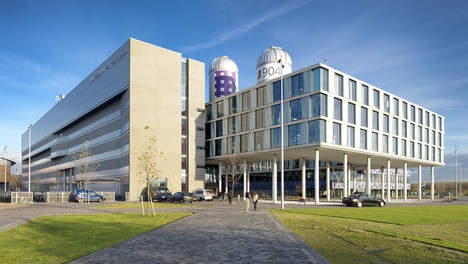

# Welkom!

*Versie: 2017--2018, avondcursus*

Welkom! De komende maanden gaan we hard aan de slag om jou te leren programmeren—en ondertussen allerlei aspecten van de informatica toe te lichten. We hebben er veel zin in!

In dit document vind je praktische informatie over de cursus en over regels die wij belangrijk vinden. Let op: het gaat er bij ons soms nogal anders aan toe dan bij andere opleidingen.

<iframe style="width:100%; height: 280px;" src="https://player.vimeo.com/video/130987431?color=ff9933&title=0&byline=0&portrait=0" frameborder="0" webkitallowfullscreen mozallowfullscreen allowfullscreen></iframe>
<a href="http://www.bloomberg.com/graphics/2015-paul-ford-what-is-code/"> 
Bron: <em>What is code?</em> van Paul Ford. Lees dat essay!</a>

Wat kun je verwachten komende tijd? Heel veel zelf programmeren, dat staat op nummer één. Daarnaast geven we je elke week weer kleine stukjes informatica om over na te denken, zodat je een goede basis in de theorie hebt. En ook heel belangrijk: begeleiding van ervaren programmeurs, studenten en docenten.

We hopen je snel te spreken, maar mocht je nu al even iets willen toelichten stuur dan gerust een mailtje naar <help@mprog.nl>. We nemen dan snel contact met je op.

## Wat ga je doen?

Je gaat vanaf het allereerste begin leren programmeren in een hele reeks talen, zoals Scratch, C, Javascript en Python. De essentie is ontzettend veel oefenen met kleinere opdrachten om zo goed te begrijpen hoe alles in elkaar zit. Elke week leren we je weer een paar nieuwe mogelijkheden, en elke week begrijp je beter hoe het werkt. Toch kunnen deze vakken ook wel frustrerend zijn, bijvoorbeeld als er iets totaal niet werkt terwijl je toch zeker wist dat... Daarom vinden we het belangrijk dat je regelmatig tijd bij ons in het lab besteedt, zodat we je één van de belangrijkste dingen kunnen leren: zelf systematisch zulke problemen overwinnen.

## Verwachtingen

Hier proberen we een overzicht te geven van de belangrijkste verwachtingen die we van jou hebben, maar ook van wat je van ons kunt verwachten.

### Wat we van jou verwachten

Je hebt géén voorkennis nodig. Er zijn altijd studenten die al eens geprogrammeerd hebben, en die hebben het in het begin natuurlijk iets makkelijker, maar ons programma is ingericht op volledig onervaren studenten.

Je belangrijkste activiteit is héél veel programmeren, en we verwachten dus ook dat je dit doet. Leren programmeren kost heel veel tijd, en je zult waarschijnlijk meer uren maken dan je gewend bent van andere vakken. Maar zonder deze oefening kom je niet vooruit!

Om de frustratie te beperken, en om te kunnen zien dat jij je eigen werk doet, willen we dat je een redelijk aantal uren bij ons aanwezig bent. We hebben tijd gereserveerd op maandag t/m donderdag 16:00--19:00 uur.

We vinden het ook belangrijk dat je openstaat voor vragen van je medestudenten en zelf regelmatig de mensen om je heen om hulp vraagt. Natuurlijk is het niet de bedoeling om elkaar de hele opdracht voor te zeggen, maar als je veel discussieert over de opdracht en je ideeën voor oplossingen, dan help je elkaar enorm verder!

We vragen van jou een actieve bemoeienis met je eigen voortgang. Zorg dat je goed bijhoudt waar je staat en wat je nog moet doen, en neem bij vragen en problemen meteen contact op. Kun je je assistent niet vinden? Stuur dan meteen een mail naar <help@mprog.nl>.

Om het allemaal een beetje soepel te laten verlopen verwachten we dat je alle mededelingen op de websites én alle mededelingen in je e-mail goed bijhoudt. Dat je dit document aan het lezen bent is al een goed begin!

### Wat je van ons mag verwachten

We verwachten van jou een actieve houding, maar het is ook fijn als je een persoonlijk aanspreekpunt hebt. Daarom hebben we voor elke groep een eigen assistent. Deze assistent houdt bij hoe het met je gaat en nodigt je af en toe uit voor een gesprek over de voortgang.

Om goed te leren van je eigen "fouten", mag je van ons verwachten dat je genoeg feedback krijgt. We kijken je werk elke week na en geven je dan ideeën om het beter te doen. Krijg je niet genoeg feedback, of wil je meer horen over een specifiek onderwerp? Gewoon vragen!

## Praktische zaken

 <small>Faculteit der Natuurwetenschappen, Wiskunde en Informatica, Science Park 904, Amsterdam</small>

### Planning

De vakken Programmeren 1 en Programmeren 2 behelzen elk ongeveer een studielast van 170 uur. Afhankelijk van het aantal uur dat je per week kunt reserveren, kunnen we bepalen wat een realistische einddatum is, en wat de deadlines moeten worden. Let wel op dat bij een inzet van minder dan 10 uur per week de slagingskans erg laag wordt.

Ben je nieuw? Of start je weer na lange tijd? Maak dan nu een afspraak om samen met ons een aangepaste planning te maken:

<!-- Calendly inline widget begin -->

<!-- Calendly inline widget end -->

### Roosters

Je kunt zelf kiezen wanneer je komt; we staan voor je klaar op dinsdag t/m donderdag van 15:00 tot 19:00 uur. Je kijkt zelf op andere momenten de videocolleges en je doet zoveel mogelijk aan de opdracht, maar de begeleiding krijg je tijdens deze uren. Een keertje missen is natuurlijk geen probleem.

### Tentamens

Programmeren 1 en 2 hebben elk een tentamen. Studenten van de avondcursus kunnen (onder voorbehoud) deelnemen aan de tentamens op de volgende data. [Meld je hier aan voor tentamens](https://calendly.com/stgm/tentamens).

| vak            | datum             |  
| -------------- | ----------------- |  
| Programmeren 1 | 12 maart om 17:00 |  
| Programmeren 1 | 9 april om 17:00  |  
| Programmeren 2 | 11 april om 17:00 |  
| Programmeren 2 | 11 juni om 17:00  |  

### Locatie

Alle lessen vinden plaats in het Science Park in Amsterdam. Het hoofdgebouw aldaar heeft huisnummer 904, en onze vaste lokaal is A1.16 op de eerste verdieping.

### Website

Alle cursusmaterialen zullen via een website beschikbaar worden gesteld; tijdens de eerste kennismaking verwijzen we je naar de juiste website.

### Benodigdheden

Om mee te doen met de minor heb je een laptop nodig. Zo'n beetje elke laptop met 8GB intern geheugen voldoet (4GB is ook wel goed). Dat je WiFi werkt is wel een vereiste! Heb je problemen met het instellen van je draadloos internet? Loop dan alvast een keer langs bij de bibliotheekbalie op de eerste verdieping van ons gebouw.

Wil je een goede korting op een Mac? Gebruik dan [deze link](http://www.apple.com/nl_edu_124399/shop) van Surfspot.

Je hebt geen boeken nodig.

### Administratie

Heb je vragen over de administratie van cijfers? Neem dan contact op met de servicedesk van onze faculteit via (020) 525 7100 of stuur een mail. Je kunt ook gewoon even langs gaan: de balie bevindt zich op de eerste verdieping van ons gebouw en is elke werkdag open tussen 9 en 17 uur.

## Adviezen

Studenten uit vorige edities hebben ons deze tips gestuurd om door te geven:

> "Deze minor is een enorm goede kickstarter als je ook maar een beetje interesse hebt in programmeren of zou willen weten hoe het is om te programmeren. Aan het einde van deze minor heb je de gereedschappen—en, misschien wel belangrijker—een manier van denken aangeleerd om verder te gaan met programmeren op je eigen kracht."

> "Onderschat niet hoeveel tijd het kost om te leren programmeren from scratch. Heb je al wat ervaring dan is dit vak goed te volgen, maar ik kan me voorstellen dat de werkdruk voor beginners erg hoog is."

> "Plan bewust een moment in dat je de video's gaat bekijken, anders ga je het overslaan en dat is niet goed voor je tempo bij de problem sets."

> "Vraag op tijd om hulp als er dingen zijn die je niet snapt of onduidelijk vind, want kleine probleempjes kunnen er voor zorgen dat je hele code niet (of foutief) werkt. Zorg dat je alle lectures van tevoren kijkt en de discipline opbrengt om de tijd er in te steken die ervoor wordt opgegeven en behandel eerst alle noodzakelijke punten voordat je je code 'opleukt' met extra functies."

> "Hou er rekening mee dat er veel tijd in kan gaan zitten en je soms echt moet doorzetten. Voor de rest laat je lekker verrassen."

> "Klamp zoveel mogelijk vast aan de studentassistenten als je iets niet snapt. Wees niet bang om te vragen, soms heb je net dat zetje nodig."

> "Oefening baart kunst. Bij Programmeren 1 & 2 was er echt een hele goede opbouw in de moeilijkheidsgraad van de programma's, waardoor je echt merkt dat je steeds in stappen verder komt. Verder was het fijn dat er een bepaald soort flexibiliteit was qua werken en aanwezigheid, en tegelijkertijd ook genoeg oplettendheid om je niet het gevoel te geven dat je voor niks kwam of juist wegbleef. En verder een goeie sfeer, ongeacht het feit dat er toch vaak genoeg gefrustreerd naar computerschermen gekeken wordt."

## FAQ

Heb je nog een vraag? Stuur ons een e-mail. Binnenkort verschijnen hier dan meer vragen en antwoorden zoals die gesteld zijn.

### Afwezigheid

Is het mogelijk afwezig te zijn bij een werkcollege, practicum e.d.? Ja, maar hou het beperkt zodat je een vaste regelmaat hebt.

Ben je ziek? Dan helpen we je graag weer op de rails! Het is dan belangrijk dat je het direct meldt en ons op de hoogte houdt!

### Afronden

Kun je een certificaat krijgen voor de cursussen Programmeren 1 en 2? Ja, als je de vakken als contractonderwijs volgt krijg je bij het afronden een certificaat (vraag dit alsjeblieft bij ons per mail aan). Als je reguliere UvA-student bent, krijg je gewoon studiepunten.

<small>Copyright 2015–2017 Martijn Stegeman. Dit werk valt onder een [Creative Commons Naamsvermelding-GelijkDelen 4.0 Internationaal](http://creativecommons.org/licenses/by-sa/4.0/)-licentie.</small>
