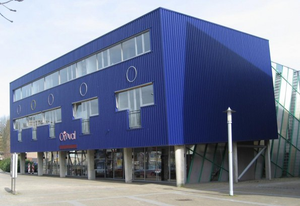

# Welkom bij de Minor Programmeren!

*Versie: herfst 2021, fulltime*

De komende maanden gaan we hard aan de slag om jou te leren zelfstandig programmeerproblemen op te lossen, kleine visualisaties te maken, en tools voor je eigen onderzoek te bouwen. Je gaat ook kennis maken met een heleboel bestaande tools, technieken, talen en theorieën die je nodig hebt om succesvol (mee) te werken aan grotere programma's.

In dit document vind je praktische informatie over de minor en over regels die wij belangrijk vinden. Let op: het gaat er bij ons soms nogal anders aan toe dan bij andere opleidingen.

<iframe style="width:100%; height: 280px;" src="https://player.vimeo.com/video/130987431?color=ff9933&title=0&byline=0&portrait=0" frameborder="0" webkitallowfullscreen mozallowfullscreen allowfullscreen></iframe>
<a href="http://www.bloomberg.com/graphics/2015-paul-ford-what-is-code/">
Bron: <em>What is code?</em> van Paul Ford. Lees dat essay!</a>

Het semester zal weer geheel op locatie plaatsvinden (zie verderop), en dat betekent dat je elke werkdag van 9 tot 17 uur aanwezig zult zijn en samen met medestudenten en assistenten aan de slag gaat met oefeningen, grote opdrachten en toetsjes. Je zult letterlijk elke dag programma's schrijven!

We hopen jullie allemaal te spreken in de eerste paar dagen van de minor, maar mocht je nu al even iets willen toelichten stuur dan gerust een mailtje naar <help@mprog.nl>. We nemen dan snel contact met je op.

> **Geen paniek!** In de komende tijd zul je merken dat bij de minor studenten rondlopen met méér en met minder ervaring. Dat is heel mooi, want dan kunnen we van elkaar leren, en bovendien hebben we opdrachten op niveau voor elk van deze studenten. Maar voel je niet geïntimideerd, dat is veel belangrijker. Iedereen komt hier om iets te leren, en je gaat heel ver komen, verder dan je misschien zou denken. Daarnaast is de aandacht van de staf vol gericht op studenten die nog geen ervaring hebben. Dat zijn onze belangrijkste studenten, die nog veel te leren hebben.

## Coronamaatregelen

1. De bedoeling is dat zoveel mogelijk mensen gevaccineerd zijn en dat iedereen 2x per week een zelftest afneemt. Zelftests bestel je gratis op [deze site](https://www.zelftestonderwijs.nl). Als je niet tijdig beschikt over zelftests laat je het ons weten, dan helpen we je verder.

    Heb je buiten de minor nog activiteiten met groepen/groepjes mensen, zorg dan dat je je vaker test. Hoe beter wordt getest, hoe minder mensen tijdelijk uitvallen en achterstand oplopen.

2. Er is een normale aanwezigheidsplicht voor de dagelijkse werkzaamheden, dus van 9 tot 17 uur. De (fulltime) minor is gebouwd op aanwezigheid, hard werken en intensieve begeleiding van ons. Als je dit op dit moment niet wilt of kunt, overleg dan even voordat je begint! Er zijn alternatieven.

3. Je mag niet naar de UvA komen als je:
    - Verkoudheidsachtige klachten hebt
    - Positief getest bent met zelftest of officiële test

4. Als je door ziekte een langere tijd afwezig moet zijn dan wordt het natuurlijk lastiger om alles in te halen. Vanzelfsprekend kunnen wij je als team zoveel mogelijk ondersteunen. We houden je wel aan de deadlines, maar je zult merken dat we heel redelijk zijn als jij je verder gewoon aan de aanwezigheidsplicht houdt. Daarom hebben we deze aanwezigheidsplicht ook op onze website gezet vóór de inschrijvingen werden geopend.

5. Als je nou onverhoopt toch een keer positief test maar niet ziek bent, dan ben je fit genoeg om thuis verder te werken. In dat geval kun je gewoon assistentie van ons krijgen via een videoverbinding. Je moet dit per mail melden, maar bewijs is niet nodig ([hoe fake je een zelftest](https://theconversation.com/covid-19-kids-are-using-soft-drinks-to-fake-positive-tests-ive-worked-out-the-science-and-how-to-spot-it-163739)). We gaan er van uit dat dit een keer kan gebeuren, maar het zal waarschijnlijk niet bij één student meermaals gebeuren. Dit is dus een beperkt aanbod.

6. Er gelden nog enkele basisregels om besmettingen van groepen te voorkomen:
    - In de hele UvA mondkapjes op, maar **in** onze eigen lokalen mogen ze af
    - In al onze vaste lokalen gaan voorlopig de buitenramen op een kier
    - Faciliteiten binnen de UvA zijn beperkt, zoals aantal plaatsen in de kantine
    - Er mag geluncht worden in de lokalen tussen 12 en 13 uur, maar je ruimt je eigen troep op
    - Er mogen géén studenten van buiten de minor in onze lokalen komen
    - Je krijgt een vast lokaal met 24 tot 32 studenten en komt niet in de andere lokalen

7. Het introductiecollege gaat door in Diemen (zie onder), maar het is niet verplicht. We zijn daar met ca. 70 studenten. Als alternatief is er een videocollege dat je tegelijkertijd kunt kijken (wel iets saaier, helaas). Er zijn voorlopig geen andere grote bijeenkomsten. Meer informatie over de intro krijg je enkele dagen van tevoren.

8. Maak je je op een of andere manier zorgen, mail dan gerust naar <help@mprog.nl> en Martijn of iemand van het team denkt met je mee. Het is belangrijk dat iedereen die zich zorgen maakt deze zorgen ook <u>meteen</u> uit, zodat we goed kunnen zien of meerdere mensen ergens mee zitten.

9. Er is best een kans dat de maatregelen na een paar weken veranderen... maar we gaan het gewoon zien.

## Introductie

<a href="https://www.theaterdeomval.nl"> <small>Theater de Omval, Ouddiemerlaan&nbsp;104,  Diemen</small></a>

Op de eerste dag, maandag 6 september, komen we bijeen om 9:30 in Theater de Omval (Diemen) voor het inleidende college. Zoals je misschien al weet, gebruiken we veel videomateriaal, en tijdens deze bijeenkomst tonen we de eerste fragmenten uit de colleges van Harvard. Daarna ga je meteen aan de slag op het Science Park, dus neem je opgeladen laptop mee!

## Aanwezigheid

We hebben een aanwezigheidsplicht bij de fulltime-minor. Heel simpel: je bent er **elke werkdag** tussen 9:00 en 17:00 uur. Dit geldt voor het hele semester, dus t/m vrijdag 4 februari. Op die laatste dag zijn de eindpresentaties van het laatste vak, en je kunt het niet halen als je er niet bent!

Natuurlijk is er tijdens de minor wél gewoon ruimte voor een keer een trouwerij of doktersbezoek. Kun je de aanwezigheid zoals hier benoemd niet volbrengen? Dan moet je switchen naar de parttime-minor! Neem dan nu al contact op met <help@mprog.nl>.

Er is tijdens het semester natuurlijk wel een **kerstvakantie**, namelijk van 25 december t/m 9 januari. Ook hier geldt: als je bijvoorbeeld naar het buitenland gaat kun je niet een paar dagen later terugkomen. Misschien ook goed om te weten: er is geen herfstvakantie bij de UvA.

## Wat ga je doen?

Als je de hele minor gaat volgen, dan zul je drie fases doorlopen, die we hier beschrijven.



## Verwachtingen



## Praktische zaken

### Locatie

Alle colleges (behalve het introductiecollege!) vinden plaats op het Science Park in Amsterdam. Het hoofdgebouw aldaar heeft huisnummer 904, en onze vaste lokalen zijn A1.16, A1.18 en A1.24 op de eerste verdieping.



### Roosters

Het rooster is vrij eenvoudig: elke werkdag van 9 tot 17 uur practicum, waarbij je aan programmeeropdrachten werkt met assistentie van ons team. 's Ochtends zijn er activiteiten met je team en 's middags is er altijd mogelijkheid om assistentie te krijgen. Er is een dagschema waarin alle opdrachten vermeld staan en we proberen de grote opdrachten niet aan het eind van de week te plannen.

Omdat bijna alle activiteiten op onze vaste locatie plaatsvinden staan de activiteiten niet vermeld in het normale UvA-rooster. Ga er van uit dat je elke dag van 9 tot 17 uur op Science Park bent.

### Groepsindeling

De groepsindeling voor de minor wordt door ons gedaan op basis van opgegeven ervaring en onze eigen ervaringen met studenten van de verschillende opleidingen. Daarnaast vinden we het belangrijk dat de mentorgroepen inclusief zijn, met toenadering en afwisselende samenwerking tussen alle deelnemers, dus we zijn terughoudend met het bij elkaar indelen van groepen studenten die al gewend zijn intens met elkaar samen te werken. Je kunt dus in normale omstandigheden geen voorkeur doorgeven.

### Tentamens



## Benodigdheden





## Beperkingen



## Administratie



## Voorbereiding



Kortom, geniet van de zomer en tot in september!
