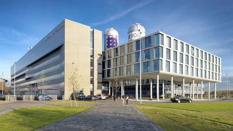

# Welkom bij de Minor Programmeren!

*Versie: lente 2020, fulltime*

Welkom! De komende maanden gaan we hard aan de slag om jou te leren zelfstandig een website op te zetten en te bouwen, bijvoorbeeld met datavisualisaties voor je onderzoek, of een informatieve website voor je eigen bedrijf of onderzoeksgroep. Of misschien een webshop, waar je zelfgemaakte producten gaat verkopen, of misschien wel een website voor het verzamelen van onderzoeksgegevens onder grote groepen deelnemers. Het kan van alles zijn. We hebben er veel zin in!

In dit document vind je praktische informatie over de minor en over regels die wij belangrijk vinden. Let op: het gaat er bij ons soms nogal anders aan toe dan bij andere opleidingen.

<iframe style="width:100%; height: 280px;" src="https://player.vimeo.com/video/130987431?color=ff9933&title=0&byline=0&portrait=0" frameborder="0" webkitallowfullscreen mozallowfullscreen allowfullscreen></iframe>
<a href="http://www.bloomberg.com/graphics/2015-paul-ford-what-is-code/"> 
Bron: <em>What is code?</em> van Paul Ford. Lees dat essay ter voorbereiding!</a>

Wat kun je verwachten komende tijd? Heel veel zelf programmeren, dat staat op nummer één. Daarnaast geven we je elke week weer kleine stukjes informatica om over na te denken, zodat je een goede basis in de theorie hebt. En ook heel belangrijk: begeleiding van ervaren programmeurs, studenten en docenten.

We hopen jullie allemaal te spreken in de eerste paar dagen van de minor, maar mocht je nu al even iets willen toelichten stuur dan gerust een mailtje naar <help@mprog.nl>. We nemen dan snel contact met je op.

> **Geen paniek!** In de komende tijd zul je merken dat bij de minor studenten rondlopen met méér en met minder ervaring. Dat is heel mooi, want dan kunnen we van elkaar leren, en bovendien hebben we opdrachten op niveau voor elk van deze studenten.
> 
> Maar voel je niet geïntimideerd, dat is veel belangrijker. Iedereen komt hier om iets te leren, en je gaat heel ver komen, verder dan je misschien zou denken. Daarnaast is de aandacht van de staf vol gericht op studenten die nog geen ervaring hebben. Dat zijn onze belangrijkste studenten, die nog veel te leren hebben.

## Introductiebijeenkomst

<a href="https://www.codam.nl"> <small>Codam, gebouw 039, Kattenburgerstraat&nbsp;7, Amsterdam</small></a>

Op de eerste lesdag, maandag 3 februari, komen we bijeen om 9:30 bij onze vrienden van Codam voor het inleidende college. Zoals je misschien al weet, gebruiken we veel videomateriaal, en tijdens deze bijeenkomst tonen we de eerste fragmenten uit de colleges van Harvard en vertellen we hoe wij werken. Daarna ga je meteen aan de slag op het Science Park, dus neem je opgeladen laptop mee!

## Aanwezigheid

We hebben een aanwezigheidsplicht bij de fulltime-minor. Heel simpel: je bent er **elke werkdag** tussen 9:00 en 17:00 uur. Dit geldt voor het hele semester, dus t/m vrijdag 26 juni. Op die laatste dag zijn de eindpresentaties!

Natuurlijk is er wél ruimte voor een keer een trouwerij of doktersbezoek, maar niet voor tentamens van andere vakken. Kun je de aanwezigheid op die manier niet volbrengen? Dan moet je switchen naar de parttime-minor, en dat kan nog! Neem direct contact op met <help@mprog.nl>.

Wij hebben dit semester een **meivakantie** ingepland, namelijk van 25 april t/m 5 mei. Lekker lang, en mooi in het midden van het semester! In ruil betekent dat dat je op geen enkel ander moment vakantie zult kunnen nemen (er zijn nog wel een paar losse dagen zoals Hemelvaart).

## Wat ga je doen?

Als je de hele minor gaat volgen, dan zul je drie fases doorlopen, die we hier beschrijven.

### Fase 1: Programmeren

Onze eerste vakken zijn **Programmeren 1** en **Programmeren 2**. Daar ga je vanaf het allereerste begin leren programmeren in een hele reeks talen, zoals Scratch, C en Python. De essentie van deze vakken is ontzettend veel oefenen met kleinere opdrachten om zo goed te begrijpen hoe alles in elkaar zit. Elke week leren we je weer een paar nieuwe mogelijkheden, en elke week begrijp je beter hoe het werkt. Toch kunnen deze vakken ook wel frustrerend zijn, bijvoorbeeld als er iets totaal niet werkt terwijl je toch zeker wist dat... Daarom vinden we het belangrijk dat je een groot deel van de tijd bij ons in het lab besteedt, zodat we je één van de belangrijkste dingen kunnen leren: zelf systematisch zulke problemen overwinnen.

We hebben voor Programmeren 1 en 2 een heel programma samengesteld met diverse activiteiten die allemaal samenhangen. Alle onderdelen moeten daarom ook op volgorde gedaan worden! Om een indruk te krijgen van wat je zoal doet:

- Voorbereiding: videocollege (van Harvard)
- Oefening: basisboek met veel kleine haalbare "sommen"
- Tussentoetsen: over de basisconcepten
- Oefening: typische programmeerproblemen uitpluizen en leren herkennen
- Werkgroep: met je medestudenten en assistent kennis maken en uitwisselen
- Opdrachten: oefenen met probleemoplossen in uitdagende opdrachten
- Tentamen: gemengde vragen over de verschillende onderdelen

### Fase 2: Verdieping en toepassingen

De toepassingskant krijg je bij **Web App Studio** waar we volop de *platforms* induiken. Om snel een mooi product te maken is het natuurlijk handig om onderdelen te hergebruiken. Frameworks om websites te bouwen geven je een heleboel van die onderdelen cadeau. Maar toch is er elke paar jaar wel weer een nieuw platform beschikbaar om nieuwe soorten applicaties te ontwikkelen. We leren je goed begrijpen hoe dat soort platforms in elkaar zit en hoe je later zelf weer nieuwe aan kunt leren.

Dan is er het **Programmeerproject**. Daar ga je een heel eigen idee voor een web app verzinnen, uitwerken, en implementeren. We begeleiden je procesmatig, maar je bent al zo ver gevorderd, dat je zelf grotendeels weet hoe je dingen moet uitzoeken die je nog niet kan, maar wel nodig hebt om je plan tot een goed einde te brengen. Natuurlijk sluiten we, vlak voor de kerst, af met een epic demonstratie van alle games, apps en visualisaties - en nodig vooral vrienden en familie uit om mee te kijken!

### Fase 3: Project

Nu je kunt programmeren gaan we je verder helpen je theoretisch te ontwikkelen. Dat gebeurt bij het vak **Programmeertheorie**, waar je met een team van 3 studenten aan één groot project werkt en elke week nieuwe, betere algoritmes gaat uitproberen. Een pittig einde van de minor, maar ook een kans om lekker experimenteel te leren en een kijkje in de keuken van de informatica te krijgen. Dit vak sluit formeel af met een middag waarop elk team hun nieuwe inzichten presenteert.

## Verwachtingen

Hier proberen we een overzicht te geven van de belangrijkste verwachtingen die we van jou hebben, maar ook van wat je van ons kunt verwachten.

### Wat we van jou verwachten

Je hebt géén voorkennis nodig. Er zijn altijd studenten die al eens geprogrammeerd hebben, en die hebben het in het begin natuurlijk iets makkelijker, maar ons programma is ingericht op volledig onervaren studenten.

Je belangrijkste activiteit is héél veel programmeren, en we verwachten dus ook dat je dit doet. Leren programmeren kost heel veel tijd, en je zult waarschijnlijk meer uren maken dan je gewend bent van andere vakken. Maar zonder deze oefening kom je niet vooruit!

Om de frustratie te beperken, en om te kunnen zien dat jij je eigen werk doet, willen we dat je een substantieel aantal uren bij ons aanwezig bent. Het tempo ligt enorm hoog, dus het is belangrijk dat je altijd bij ons en je medestudenten in de buurt bent als je er niet snel uit komt.

> Voor fulltime-studenten gaat het zo: je bent elke werkdag in onze lokalen aanwezig tussen 9:00 en 17:00 uur.

Nu je toch zoveel aanwezig bent, vinden we het ook heel belangrijk dat je openstaat voor vragen van je medestudenten en zelf regelmatig de mensen om je heen om hulp vraagt. Natuurlijk is het niet de bedoeling om elkaar de hele opdracht voor te zeggen, maar als je veel discussieert over de opdracht en je ideeën voor oplossingen, dan help je elkaar enorm verder!

We vragen van jou een actieve bemoeienis met je eigen voortgang. Zorg dat je goed bijhoudt waar je staat en wat je nog moet doen, en neem bij vragen en problemen meteen contact op. De docenten bereik je via <help@mprog.nl>.

Om het allemaal een beetje soepel te laten verlopen verwachten we dat je alle mededelingen op de websites én alle mededelingen in je e-mail goed bijhoudt. Dat je dit document aan het lezen bent is al een goed begin!

### Wat je van ons mag verwachten

Omdat we vragen dat jij aanwezig bent, willen we ook dat dat zin heeft. Natuurlijk is het essentieel dat je met je medestudenten discussieert en overlegt over de opdrachten en de stof, maar je mag ook verwachten dat wij regelmatig aanwezig zijn en je terzijde staan. Zeker in het begin zijn er dus vrijwel altijd assistenten aanwezig om je nét even die drempel over te helpen of een moeilijke vraag door te spreken.

We verwachten van jou een actieve houding, maar zeker in de inleidende vakken is het fijn als je een persoonlijk aanspreekpunt hebt. Daarom is er voor jou een tutor, die bijhoudt hoe het met je gaat, je opdrachten nakijkt en werkgroepen organiseert. Daarnaast zijn er enkele zeer ervaren assistenten en docenten, die je bijstaan op het moment dat je er echt even niet meer uitkomt.

Om goed te leren van je eigen "fouten", mag je van ons verwachten dat je genoeg feedback krijgt. We kijken je werk elke week na en geven je dan ideeën om het beter te doen. Krijg je niet genoeg feedback, of wil je meer horen over een specifiek onderwerp? Gewoon vragen!

## Praktische zaken

### Roosters

In beginsel is het rooster vrij eenvoudig: elke werkdag van 9 tot 17 uur practicum, waarbij je aan programmeeropdrachten werkt met assistentie van ons team. Soms zijn er activiteiten zoals werkcolleges of tentamens. Deze worden vrijwel allemaal tijdens de standaarduren gepland. Vanaf de aanvang van de minor (begin februari) zullen o.a. de tentamens juist in het rooster vermeld staan. Andere activiteiten staan er niet in, omdat je gewoon van 9 tot 17 uur aanwezig moet zijn.

 <small>Faculteit der Natuurwetenschappen, Wiskunde en Informatica, Science Park 904, Amsterdam</small>

### Locatie

Alle lessen (behalve het introductiecollege!) vinden plaats in het Science Park in Amsterdam. Het hoofdgebouw aldaar heeft huisnummer 904, en onze vaste lokaal is A1.16 op de eerste verdieping.

### Tentamens

Programmeren 1 en 2 hebben een afsluitend tentamen. Met het halen van het tentamen krijg je toegang tot het volgende vak van de minor. De precieze data worden op een later moment bekend gemaakt.

### Team

Verdeeld over de vakken zijn er vele docenten en assistenten die hoorcollege en werkcollege geven, die je begeleiden in het lab of die je opdrachten nakijken. Probeer ons te leren kennen (wij proberen ook jou te leren kennen). In het begin zijn we herkenbaar aan een t-shirt of een naamplaatje. Op onze [website](https://www.mprog.nl/team) staan binnenkort weer up-to-date foto's van alle medewerkers!

### Website

Alle cursusmaterialen zullen via een website beschikbaar worden gesteld; bij aanvang van de cursus krijg je een linkje! Er zal géén gebruik worden gemaakt van Blackboard of Canvas, dus het heeft ook geen zin om onze cursussen in die omgeving op te zoeken.

### Voorbereiding

Sommige studenten willen zich graag voorbereiden voor de minor, maar dat is niet de bedoeling. Wij gaan er vanuit dat je zonder ervaring binnenkomt en je laat "meevoeren" door onze videocolleges, opdrachten en toetsjes. Een leuke manier om toch nog wat te doen, is het lezen van het essay "What is code," zoals bovenaan deze pagina gelinkt. Dit is een algemene inleiding in allerlei aspecten van het programmeren en software bouwen in bedrijven.

### Benodigdheden

1.  Om mee te doen met de minor heb je een laptop nodig. Zo'n beetje elke laptop met 8GB intern geheugen voldoet (4GB is soms ook wel goed, maar voor latere vakken misschien niet meer). Mac, Windows of Linux maakt niet uit. Dat je wifi werkt is wel een grote vereiste! Heb je problemen met het instellen van je draadloos internet? Loop dan alvast een keer langs bij de bibliotheekbalie op de eerste verdieping van ons gebouw.

    <!-- Wil je een goede korting op een Mac? Gebruik dan [deze link](http://www.apple.com/nl_edu_124399/shop) van Surfspot. In de zomer is er altijd een actie waarmee je niet alleen korting krijgt maar ook nog een gratis headphone en/of een tegoedbon. Macs zijn echter duur, dus voel je vrij om een stuk minder geld uit te geven! -->

2.  Je hoeft geen software op je laptop te installeren voor de start van de minor. Een webbrowser is voldoende.

3.  Je hoeft van tevoren geen boeken te bestellen.

### Programma aanpassen

Wil je toch nog aanpassingen doen in het minorprogramma waarvoor je bent ingeschreven? Stuur dan een bericht naar <help@mprog.nl>.

### Administratie

Heb je vragen over de administratie van cijfers? Neem dan contact op met de servicedesk van onze faculteit via (020) 525 7100 of stuur een mail. Je kunt ook gewoon even langsgaan: de balie bevindt zich op de eerste verdieping van ons gebouw en is elke werkdag open tussen 9 en 17 uur.

Mocht je vragen hebben over je inschrijving bij de UvA (bijvoorbeeld als bijvakker), neem dan contact op met de Student Service Desk, Roetersstraat 11, telefoon (020) 525 8080.

Voor bijvakkers: heb je je inschrijving helemaal geregeld, maar staat op Studielink niet dat je volledig ingeschreven bent bij de UvA? Stuur dan een screenshot van de status op Studielink naar <help@mprog.nl> en wij kijken wat we kunnen doen.

## FAQ

Heb je nog een vraag? Stuur ons een e-mail. Binnenkort verschijnen hier dan meer vragen en antwoorden zoals die gesteld zijn.

### Afwezigheid

Is het mogelijk afwezig te zijn bij een werkcollege, practicum e.d.? Ja, maar heel beperkt (enkele dagen maximaal per semester) en alleen als je dit van te voren meldt en vooruit werkt. Stuur dus een mail naar de docenten op <help@mprog.nl> en doe een voorstel.

### Ziekte

Doe je de minor fulltime en word je ziek? Dan helpen we je graag weer op de rails. Het is dan belangrijk dat je het direct meldt en ons op de hoogte houdt! Door het heftige programma is er weinig tijd om bij te komen, maar juist op zo'n moment kunnen we je bijstaan.

Meld je eventuele calamiteiten pas naderhand? Dan is de kans groot dat je het vak op een ander moment weer moet opstarten. Dat is geen probleem, maar betekent doorgaans dat je de minor niet meer in één semester kunt afronden.

### Opdrachten

Mag je opdrachten overslaan? Nee, om de vakken te halen moet je alle opdrachten en toetsen volledig en succesvol hebben afgerond. In de studiewijzer van elk vak staat welke opdrachten en toetsen dat zijn.

<small>Copyright 2015–2019 Martijn Stegeman. Dit werk valt onder een [Creative Commons Naamsvermelding-GelijkDelen 4.0 Internationaal](http://creativecommons.org/licenses/by-sa/4.0/)-licentie.</small>
