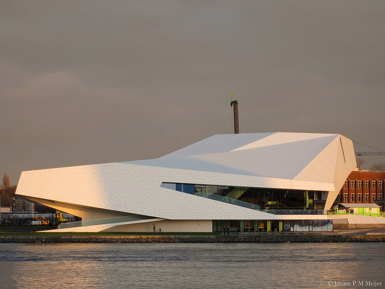

# Welkom!

*Versie: herfst 2017*

Welkom! De komende maanden gaan we hard aan de slag om jou te leren zelfstandig een programmeerproject op je te nemen, bijvoorbeeld om een app te maken of een interactieve datavisualisatie. We hebben er veel zin in!

In dit document vind je praktische informatie over de minor en over regels die wij belangrijk vinden. Let op: het gaat er bij ons soms nogal anders aan toe dan bij andere opleidingen.

Wat kun je verwachten komende tijd? Heel veel zelf programmeren, dat staat op nummer één.

<iframe style="height:50%" src="https://player.vimeo.com/video/130987431?color=ff9933&title=0&byline=0&portrait=0" frameborder="0" webkitallowfullscreen mozallowfullscreen allowfullscreen></iframe>
<a href="http://www.bloomberg.com/graphics/2015-paul-ford-what-is-code/">Bron: <em>What is code?</em> van Paul Ford.  Lees dat essay!</a>

Daarnaast geven we je elke week weer kleine stukjes informatica om over na te denken, zodat je een goede basis in de theorie hebt. En ook heel belangrijk: begeleiding van ervaren programmeurs, studenten en docenten.

We hopen jullie allemaal te spreken in de eerste paar dagen van de minor, maar mocht je nu al even iets willen toelichten stuur dan gerust een mailtje naar <help@mprog.nl>. We nemen dan snel contact met je op.

>**Geen paniek!** In de komende tijd zul je merken dat bij de minor studenten rondlopen met méér en met minder ervaring. Dat is heel mooi, want dan kunnen we van elkaar leren, en bovendien hebben we opdrachten op niveau voor elk van deze studenten. Maar voel je niet geïntimideerd, dat is veel belangrijker. Iedereen komt hier om iets te leren, en je gaat heel ver komen, verder dan je waarschijnlijk dacht.

## Introductiebijeenkomst

Op de eerste lesdag komen we bijeen in zaal 1 van het EYE filmmuseum EYE filmmuseum, IJpromenade 1, Amsterdam. voor het inleidende college. Zoals je misschien al weet, gebruiken we veel videomateriaal, en in de Turingzaal laten we je de eerste twee colleges zien die afgelopen september bij Harvard zijn opgenomen. Daarna ga je meteen aan de slag, dus neem je opgeladen laptop mee!
