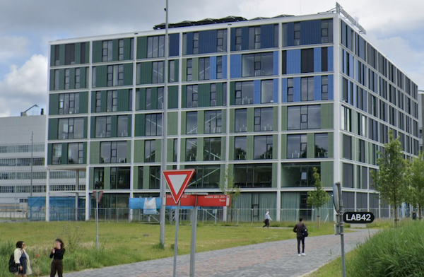

# Welkom bij de Minor Software Engineering!

*Versie: herfst 2026*

De komende maanden gaan we hard aan de slag om jouw programmeerskills flink te upgraden. Je gaat de diepte in met de programmeertaal C, je gaat praktisch aan de slag met logica en databases, je gaat heel hele nette en gestructureerde code schrijven in Python en je gaat ter afsluiting een groot project doen in een team van 3 studenten.

Na de minor kun je zelf projecten bouwen, je begrijpt hoe software in elkaar zit en hoe je overzicht kan houden, en je hebt meer dan genoeg kennis om zelf verder te leren. Bijvoorbeeld met een online cursus machine learning, een schakelprogramma voor een master, vakken uit de bachelor informatica, of technische trainingen om computationele technieken toe te passen in je eigen vakgebied. De master Software Engineering is een mooie stap als je deze minor interessant en leuk hebt gevonden.

In dit document vind je praktische informatie over de minor en over regels die wij belangrijk vinden. Let op: het gaat er bij ons nogal anders aan toe dan bij andere opleidingen.

<iframe style="width:100%; height: 280px;" src="https://player.vimeo.com/video/130987431?color=ff9933&title=0&byline=0&portrait=0" frameborder="0" webkitallowfullscreen mozallowfullscreen allowfullscreen></iframe>
<a href="http://www.bloomberg.com/graphics/2015-paul-ford-what-is-code/">
Bron: <em>What is code?</em> van Paul Ford. Lees dat essay!</a>

Je hebt er voor gekozen de hele minor in één semester te volgen. Dat betekent dat de werkdruk pittig is ten opzichte van veel bacheloropleidingen. Je gaat immers meer de diepte in. Maar als je aanwezig kunt zijn is het goed te doen.

We hopen jullie allemaal te spreken in de eerste paar dagen van de minor, maar mocht je nu al even iets willen toelichten stuur dan gerust een mailtje naar <help@proglab.nl>. We nemen dan snel contact met je op.

## Introductie

 <small>Lab42, Science Park &nbsp;900, Amsterdam</small>

Op de eerste dag, maandag 31 augustus, komen we 's ochtends om 9:45 bijeen in Lab42 voor het inleidende college (lokaal L0.09 op de begane grond). We starten lekker basic, om even goed in te komen na de vakantie. Je gaat de rest van de dag meteen aan de slag, dus neem je opgeladen laptop mee!

Vanaf 15 uur heb je het eerste college van Databases. De introductiedag duurt tot 17 uur.

## Inschrijven voor de vakken

Zorg dat je je via [Glass](https://glass.uva.nl/) inschrijft voor deze vakken:

- Moderne Databases voor IN/IK (5062MDVI6Y)
- Programmeren 1 (50621PRP6Y)
- Inleiding Logica (5071INLO6Y)  - let goed op de code bij dit vak!
- Programmeren 2 (50622PRP6Y)
- Algoritmen en Heuristieken (5062ALHE6Y)

## Aanwezigheid

Samenvatting: meestal 4 dagen per week een activiteit op Science Park.

Deze minor bestaat uit losse vakken, dus de aanwezigheidsplicht hangt af van de regels bij deze vakken. In het algemeen geldt dat informatievoorziening vaak in de colleges gebeurt, we gaan niet ons uiterste best doen om achter iedereen aan te gaan die een college mist. Het is geen minor op afstand. Zorg dus dat je er bent.

Hieronder een indicatie. Let op dat roosters nog wat kunnen wijzigen!

- **Periode 1** (31 augustus t/m 23 oktober)
    - Moderne Databases voor IN/IK
        - Twee hoorcolleges per week, op maandagmiddag en donderdagochtend. Aanwezigheid is belangrijk.
        - Een practicum op vrijdag (wordt nog ingedeeld). Aanwezigheid is verplicht.
        - Tentamen in week 8 van de periode, hertentamen eind december.
    - Programmeren 1
        - Werkmiddag op dinsdag en donderdag (13-16 uur). Verplichte aanwezigheid en voortgangsbespreking.
        - Eén of meer losse colleges waaronder het introductiecollege. Introductie is sowieso verplicht.
        - Tentamen in week 5, hertentamen in week 8.
- **Periode 2** (26 oktober t/m 18 december)
    - Inleiding Logica
        - Twee hoorcolleges per week, op maandag- en donderdagochtend. Aanwezigheid is zeer belangrijk, afhankelijk van hoe makkelijk logica je afgaat.
        - Werkcolleges op woensdagmiddag en vrijdagochtend. Aanwezigheid verplicht.
        - Tentamen in week 8, hertentamen eind januari.
    - Programmeren 2
        - Werkmiddag op dinsdag en donderdag (13-16 uur). Verplichte aanwezigheid en voortgangsbespreking.
        - Tentamen in week 4 of 5, herkansing vóór einde van de periode.
- **Periode 3** (4 t/m 29 januari)
    - Algoritmen en Heuristieken
        - Verplicht op maandag, dinsdag, donderdag en vrijdag 10--16 uur.
        - Heel veel verplichte hoorcolleges.
        - Alle andere tijd ben je in ons lokaal aan de slag met je team.
        - Eindpresentaties op 29 januari, geen cijfer zonder aanwezigheid.

Nog een paar aanwijzigingen:

- We starten meteen op 31 augustus, niet pas een week later.

- Misschien valt op dat er géén herfstvakantie is. Dat klopt.

- Je krijgt geen uitzondering op de aanwezigheidsplicht voor het bijwonen van extra vakken en wij houden hiermee geen rekening in de groepsindeling.

- Als je toch een ander vak erbij volgt dan kan het tentamen toevallig overlappen met onze tentamens. Wij kunnen **niet** meewerken aan het maken van onze tentamens op een ander moment.

- Natuurlijk is er tijdens de minor wél ruimte voor een keer een trouwerij of doktersbezoek. Dit is een bijzondere situatie die je goed met ons overlegt.

- Plan niet alvast je week vol met werk. Plan je werk om je studie heen en niet andersom. **Als jij zorgt dat je door de weeks beschikbaar bent komt het helemaal goed!**

## Verwachtingen

De minor is gericht op studenten die al wat programmeerervaring hebben, en die dit ook leuk vinden. We gaan er daarbij vanuit dat je qua mentaliteit echt een derdejaarsstudent bent en niet de kantjes ervan afloopt. Maar, als je nou toch in de moeilijkheden komt, dan staan wij wel klaar om je te begeleiden. We hebben veel ervaring met studenten van alle opleidingen en we hebben alles wel een keer meegemaakt. Dus benader ons gerust en dan helpen we je verder.

**Vind je programmeren best wat moeilijk, dan mag je nog switchen naar de minor Programmeren. Dat is ook een lekker uitdagend programma, maar daar hebben we veel ruimte voor studenten die nog helemaal geen programmeerervaring hebben. Er is ook aanzienlijk meer aanwezigheidsplicht. Voor een switch mail je naar <mailto:minoren@proglab.nl>.**

## Praktische zaken

### Locatie

De meeste colleges vinden plaats op het Science Park in Amsterdam. Ons gebouw "Lab42" heeft huisnummer 900, en onze vaste lokalen vind je op de begane grond. Enkele tentamens vinden plaats in één van de speciale tentamenzalen aan de randen van Amsterdam.



<!--### Groepsindeling

De groepsindeling voor de minor wordt door ons gedaan op basis van opgegeven ervaring en onze eigen ervaringen met studenten van de verschillende opleidingen. Daarnaast vinden we het belangrijk dat de werkcolleges inclusief zijn, met toenadering en afwisselende samenwerking tussen alle deelnemers, dus we zijn terughoudend met het bij elkaar indelen van studenten die al gewend zijn intens met elkaar samen te werken. Je kunt dus géén voorkeur doorgeven. De definitieve groepsindeling wordt pas gedaan na de start van de minor.-->

### Tentamens

De precieze data van tentamens kunnen nog wijzigen. Plan geen vakantie of belangrijke afspraken in de tentamenweek. Mocht er iets zijn dat je moet plannen, mail dan even voor overleg.

## Benodigdheden

Veel cursusmaterialen zullen via Canvas of een andere website beschikbaar worden gesteld; bij aanvang van de cursus krijg je een linkje per mail! De vakken Programmeren 1, 2 en Algoritmen en Heuristieken zul je niet op Canvas vinden. Dat klopt, die hebben een aparte website.



### Aangeraden boeken

Voor databases is het aan te raden om dit boek aan te schaffen: Silberschatz, *Database System Concepts*. Seventh edition, McGraw-Hill, 2020.

## Beperkingen



## Administratie





## Voorbereiding



Kortom, we zien je snel. Tot eind augustus in Lab42!
