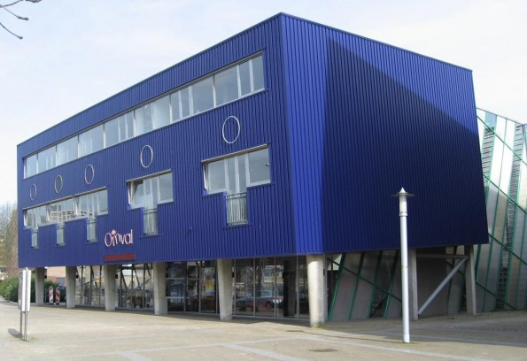

# Welkom bij de Minor Programmeren!

*Versie: lente 2024. Dit is de informatie voor studenten die beginnen bij Programmeren 1 en niet de hele minor in één semester gaan volgen.*

De komende maanden gaan we hard aan de slag om jou te leren zelfstandig programmeerproblemen op te lossen, kleine visualisaties te maken, en tools voor je eigen onderzoek te bouwen. Je gaat ook kennis maken met een heleboel bestaande tools, technieken, talen en theorieën die je nodig hebt om succesvol (mee) te werken aan grotere programma's.

In dit document vind je praktische informatie over de minor en over regels die wij belangrijk vinden. Let op: het gaat er bij ons nogal anders aan toe dan bij andere opleidingen.

<iframe style="width:100%; height: 280px;" src="https://player.vimeo.com/video/130987431?color=ff9933&title=0&byline=0&portrait=0" frameborder="0" webkitallowfullscreen mozallowfullscreen allowfullscreen></iframe>
<a href="http://www.bloomberg.com/graphics/2015-paul-ford-what-is-code/">
Bron: <em>What is code?</em> van Paul Ford. Lees dat essay!</a>

Wat kun je verwachten komende tijd? Heel veel zelf programmeren, dat staat op nummer één. Daarnaast geven we je elke week weer kleine stukjes informatica om over na te denken, zodat je een goede basis in de theorie hebt. En ook heel belangrijk: begeleiding van ervaren programmeurs, studenten en docenten.

We hopen jullie allemaal te spreken in de eerste weken van de minor, maar mocht je nu al even iets willen toelichten stuur dan gerust een mailtje naar <help@mprog.nl>. We nemen dan snel contact met je op.

> **Geen paniek!** In de komende tijd zul je merken dat bij de minor studenten rondlopen met méér en met minder ervaring. Dat is heel mooi, want dan kunnen we van elkaar leren, en bovendien hebben we opdrachten op niveau voor elk van deze studenten. Maar voel je niet geïntimideerd, dat is veel belangrijker. Iedereen komt hier om iets te leren, en je gaat heel ver komen, verder dan je misschien zou denken. Daarnaast is de aandacht van de staf vol gericht op studenten die nog geen ervaring hebben. Dat zijn onze belangrijkste studenten, die nog veel te leren hebben.

## Introductie

<a href="https://www.theaterdeomval.nl"> <small>Theater de Omval, Ouddiemerlaan&nbsp;104,  Diemen</small></a>

Op de eerste dag, maandag 2 september, komen we bijeen om 9:15 in Theater de Omval (Diemen) voor het inleidende college. Zoals je misschien al weet, gebruiken we veel videomateriaal, en tijdens deze bijeenkomst tonen we de eerste fragmenten uit de colleges van Harvard. Daarna ga je meteen aan de slag op het Science Park, dus neem je opgeladen laptop mee!

Kun je niet aanwezig zijn? Dan ontvang je in de loop van die dag (niet vooraf!) een link naar een videocollege en meer informatie over de opdrachten van de eerste week. We verwachten je tijdens de week op een aantal momenten aanwezig kunt zijn om hier aan te werken en een goede start te maken. De indeling is flexibel, dus je kunt het zelf plannen in combinatie met een ander vak!

## Wat ga je doen?

Je begint bij Programmeren 1. In dat vak ga je aan de slag met de absolute beginselen van het programmeren. We doen dat op een ambitieus niveau, maar met een hoop begeleiding. In de tweede periode kun je door met Programmeren 2, en in het volgende semester kun je dan ook nog de resterende drie vakken van de minor volgen.

## Verwachtingen



## Praktische zaken

### Locatie

Alle colleges vinden plaats op het Science Park in Amsterdam. Ons nieuwe gebouw "Lab42" heeft huisnummer 900, en onze vaste lokalen vind je op de begane grond. Enkele tentamens vinden plaats in één van de speciale tentamenzalen aan de randen van Amsterdam.



### Roosters

Je moet zelf een goed werkritme vinden voor het maken van de opdrachten en het kijken van de videocolleges. Daarvoor kom je minstens één middag werken in Lab42, te kiezen tussen **dinsdag, woensdag en donderdag**. Je kunt op die dagen tussen 13:30--16:00 uur langskomen in lokaal L0.09 en L0.10 voor een werkplek of voor assistentie.

Daarnaast zijn er **voortgangsgesprekken** met een docent. De indeling wordt rond de start van de minor gemaakt. We maken je tijdens de gesprekken wegwijs en we tekenen opdrachten af. Als je in de knel komt of planningsproblemen hebt, dan is dat de plek om het te bespreken.

### Tentamens



## Benodigdheden





## Beperkingen



## Administratie



## Voorbereiding



Kortom, geniet van de zomer en tot in september!
